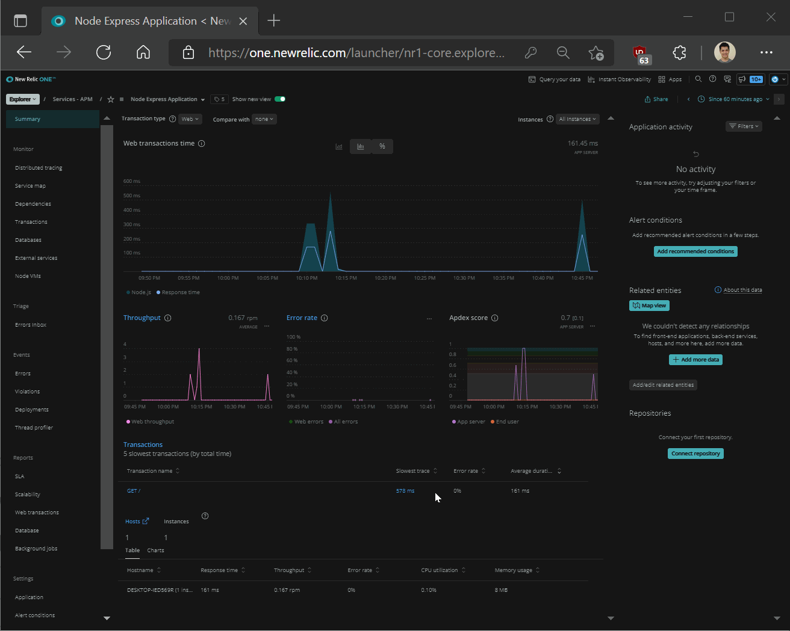

# Node-Express Application
1. Create your own Node-Express application
2. Instrument New Relic Node.js agent for your Node-Express application
3. Configure logging with `winston` and `@newrelic/winston-enricher` npm packages
4. Install New Relic Infrastructure Agent
5. Configure infrastructure agent to send Node-Express logs to New Relic

## Instrument New Relic Logs in Context
1. Install Node.js LTS
2. Set-ExecutionPolicy Unrestricted (PowerShell only)
3. Created a new express app:

    - `npm install -g express-generator`
    - `express myExpressApp --view pug`
    - `cd myExpressApp`
    - `npm install`
    - `npm install newrelic --save` (APM module)
    - `npm install winston` (logging module)
    - `npm install @newrelic/winston-enricher` ([Logs with Context](https://www.npmjs.com/package/@newrelic/winston-enricher))
    - Copy `myExpressApp/node_modules/newrelic/newrelic.js` to root of application folder `myExpressApp` and add New Relic License Key
    - `npm start` and check go to `http://localhost:3000/`

4. Edit `index.js`:

Add the following from the `@newrelic/winston-enricher` package under "Usage"
```
require('newrelic')
const newrelicFormatter = require('@newrelic/winston-enricher')
```

Add the following from the `winston` github "Readme":
```
const winston = require('winston');

const logger = winston.createLogger({
  level: 'info',
  format: winston.format.json(),
  defaultMeta: { service: 'user-service' },
  transports: [
    //
    // - Write all logs with level `error` and below to `error.log`
    // - Write all logs with level `info` and below to `combined.log`
    //
    new winston.transports.File({ filename: 'error.log', level: 'error' }),
    new winston.transports.File({ filename: 'combined.log' }),
  ],
});
```

Remove `level` and `defaultMeta`:
```
const logger = winston.createLogger({
  format: winston.format.json(),
  transports: [
    //
    // - Write all logs with level `error` and below to `error.log`
    // - Write all logs with level `info` and below to `combined.log`
    //
    new winston.transports.File({ filename: 'error.log', level: 'error' }),
    new winston.transports.File({ filename: 'combined.log' }),
  ],
});
```

Replace `format` with the example from `@newrelic/winston-enricher` and change path to log files as needed:
```
const logger = winston.createLogger({
  format: winston.format.combine(
    winston.format.label({label: 'nrtest'}),
    newrelicFormatter()
  ),
  transports: [
      new winston.transports.File({ filename: 'nrlogs/error.log', level: 'error' }),
      new winston.transports.File({ filename: 'nrlogs/info.log' })
  ],
});

```

Create some loggers with `info`, `warn`, and `error`:
```
/* GET home page. */
router.get('/', function(req, res, next) {
  res.render('index', { title: 'Express' });
  
  // Log a message
  logger.info('Information, working as intended.');
  logger.warn('Warning, incoming game.');
  logger.error('Error, exiting!');
});

module.exports = router;
```

5. Install New Relic Infrastructure Agent in Windows, and edit `newrelic-infra.yml` to contain your licnese key.

6. Create `C:\Program Files\New Relic\newrelic-infra\logging.d\file.yml` with the following:

```
logs:
    # Basic tailing of a all .log files in directory
  - name: basic-file
    file: C:\Users\Peter\Documents\GitHub\node-express\myExpressApp\nrlogs\*.log
```

6. Restart `New Relic Infrastructure Agent` and `node-express` application, and launch `http://localhost:3000/` and check New Relic for Logs in Context, Distributed Traces, etc.



# Open Telemetry
0. Set the following environment variables:
```
OTEL_EXPORTER_OTLP_ENDPOINT=https://otlp.nr-data.net:4317
OTEL_EXPORTER_OTLP_HEADERS=api-key=xxxxxxxxxxxxxxxxxxxxxxxxxxxxxxxxxxxxNRAL
```

1. To instrument OTEL agent, install the following in the `myExpressApp` directory:
```
npm install --save @opentelemetry/api
npm install --save @opentelemetry/sdk-node
npm install --save @opentelemetry/auto-instrumentations-node
npm install --save @opentelemetry/resources
npm install --save @opentelemetry/exporter-trace-otlp-grpc
npm install --save @opentelemetry/semantic-conventions
npm install --save uuid
```

2. Create a new file `tracing.js` or copy the one in this repository.

3. Edit the `package.json` file and change `"start": "node ./bin/www"` to `"start": "node -r ./tracing.js ./bin/www"`

4. Start the application with `npm start`.

5. Note: Service Name and Service Instance ID in `tracing.js` is overridden if environment variable exists:
```
OTEL_RESOURCE_ATTRIBUTES=service.name=node-express.otel,service.instance.id=d263a5aa-ceca-44e6-80a4-d5db619cf256
```